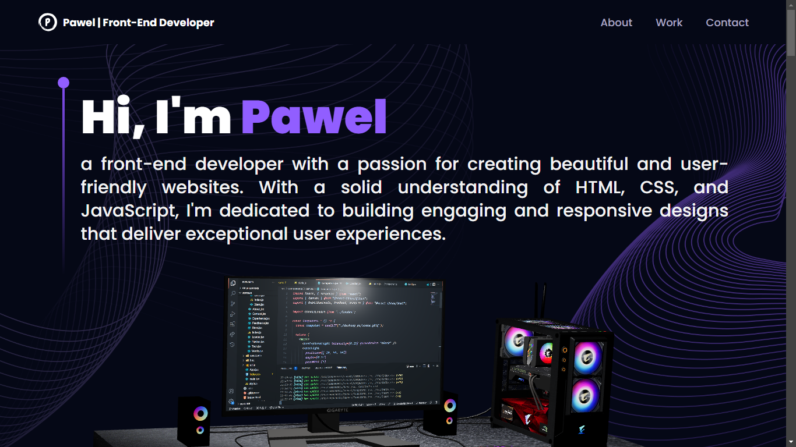

# My 3D Portfolio

## Description

This portfolio showcases my 3D skills, featuring two models sourced from Sketchfab. It's a web-based application that displays these models and provides interactive features.

## Table of Contents


- **[Installation](#installation)**
- **[Deployment](#deployment)**
- **[Resources](#resources)**
- **[Contributing](#contributing)**
- **[Questions](#questions)**
- **[License](#license)**

## Installation

To install necessary dependencies, run the following command:

```
npm install 
```

## Deployment 

Visit the live site here: [My 3D Portfolio](https://pawel-werbowy.co.uk/)

Here's a preview of the portfolio:



## Resources

- 3D Models sourced from [Sketchfab](https://sketchfab.com/).
- Built with [Three.js](https://threejs.org/), [Tailwind CSS](https://tailwindcss.com/), [Vite.js](https://vitejs.dev/), and [Email.js](https://www.emailjs.com/).
- Special thanks to [JavaScript Mastery](https://www.youtube.com/@javascriptmastery) for educational resources.

## Contributing

Fork this repository and submit a pull request to contribute.

## Questions

For inquiries, please open an issue or contact me at pawel.werbowy@gmail.com. 
Check out more of my work at [GitHub - Pav85](https://github.com/Pav85).

## License

This project is licensed under the MIT license.